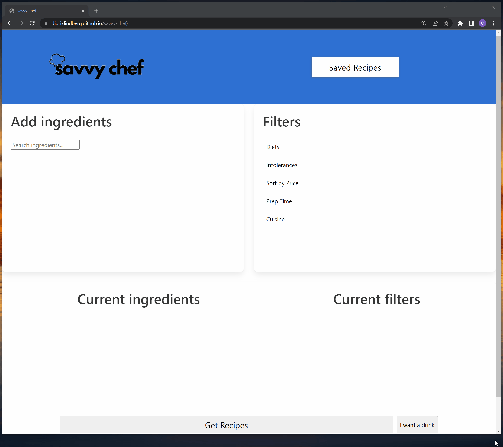

# Savvy Chef

A Recipe Generator

## Visit the Site

[Cleck Here to Visit the Deployed Site](https://didriklindberg.github.io/savvy-chef/)

## Description

Savvy Chef is a web application that helps you find recipes based on the ingredients you have on hand. With its intuitive interface, you can easily search for ingredients and add them to your list. The app then uses a Spoonacular API to suggest recipes that match your ingredient list. You can also filter the recipe results based on food intolerances, dietary restrictions, price sorting, and cuisines. Savvy chef also uses the CocktailDB API to generate delicious and unique cocktails. Savvy Chef eliminates the hassle of meal planning and helps you cook delicious meals with the ingredients you already have in your kitchen.

This app was created to address the common problem faced by users who struggle to come up with meal ideas or recipes based on the ingredients they have available at home. By providing inspiration and direct recipes tailored to individual ingredients and dietary preferences, and other criteria, the app aims to make cooking easier and more accessible for its users.There are a ton of great recipe sites that offer all kinds of filters. There are also recipe sites built around ingredient lists you feed them. But our site combines the vast filtering options with the ability to filter even further with ingredients you want to include. You can also quickly pair a cocktail with your meal.

## Technology Used

- Bulma
  [Learn about Bulma](https://bulma.io/)

- Spoonacular API
  [Learn about Spoonacular](https://spoonacular.com/food-api)

- TheCockTailDB API
  [Learn about cocktailDB](https://www.thecocktaildb.com/)

- JavaScript
  [Learn about JavaScript](https://developer.mozilla.org/en-US/docs/Web/JavaScript)

- HTML
  [Learn about HTML](https://developer.mozilla.org/en-US/docs/Web/HTML)

- CSS
  [Learn about CSS](https://developer.mozilla.org/en-US/docs/Web/CSS)

- Git
  [Learn about Git](https://git-scm.com/)

## User Stories

- As a waste-conscious person , I want to filter recipes based on ingredients I already have
- As a busy person , I want to filter recipes based on prep time
- As someone who enjoys alcohol, I’d like to receive beverage suggestions
- As someone who has a food intolerance, I want to filter out recipes that would cause me problems
- As someone you is a foodie, I want to filter for recipes based on cuisine type
- As someone who is on a specific diet, I want to be able to search recipes based on diet type

## Usage

1. Start typing in the "add ingredients" search box to find the ingredient you want.
2. Press enter or click the ingredient from the suggestion list.
3. The ingredient is now populated in the "current ingredients" list, but you can remove it by clicking the "x" next to it.
4. Once you have selected your desired ingredients, you can choose any filters you would like to apply to your recipe search. Pick as many as you would like, but you can only pick one type of diet and one type of cuisine at a time.
5. Once you are satisfied with your selections, click the "get recipes" button at the bottom of the page.
6. You will be shown recipes that meet your criteria. You can save recipes to your "saved recipes" page by clicking the "save" button next to the image.
7. If you want a random cocktail suggestion, click the "I want a drink" button to the right of the "get recipes" button.
8. If you would like to see your saved recipes, click on the "saved recipes" button at the top of the page. You have the option of clearing your saved recipes.

<br>

The site is responsize to smaller screen sizes (shown below)<br>
<br>

The app calls two third party API (Spoonacular & CocktailDB) can be seen in console
<br>

## Code Highlight

I wanted to highlight this code snippet because this code is by far the most complex api search any of us have done. sets an event listener for the button with ID "get-recipes". When the button is clicked, it makes an asynchronous API call to the Spoonacular complexSearch endpoint, using the parameters created in the preceding lines of code. The API URL is constructed by concatenating the various parameters together. One cool thing about this code is the use of template literals to create the URL string in a more readable and efficient way. Another cool thing is the use of the ternary operator to add optional parameters to the URL only if they are present.

```JavaScript
 var getRecipesButton = document.getElementById("get-recipes");
  getRecipesButton.addEventListener("click", async function () {
    resultsContainer.style.display = "";
    cocktailButton.classList.add("is-4");

    var selectedIngredients = selectedItems.join();

    var spoonacularApiKey = "2e39a525784f4df6bc533d1a0e3e2403";

    var intolerancesParam =
      intolerances.length > 0 ? "&intolerances=" + intolerances.join(",") : "";

    var dietsParam = selectedDiet ? "&diet=" + selectedDiet : "";

    var maxReadyTimeParam =
      selectedMaxReadyTimes.length > 0
        ? "&maxReadyTime=" + Math.min(...selectedMaxReadyTimes)
        : "";

    var cuisineParam = selectedCuisine ? "&cuisine=" + selectedCuisine : "";

    // Constructed the full API URL for the Spoonacular complexSearch endpoint
    var apiURLspoonacular =
      "https://api.spoonacular.com/recipes/complexSearch?includeIngredients=" +
      selectedIngredients +
      "&number=10&addRecipeInformation=true" +
      intolerancesParam +
      maxReadyTimeParam +
      dietsParam +
      cuisineParam +
      "&apiKey=" +
      spoonacularApiKey;
```

## Learning Points

- Furthered knowledge of local storage, saving and retrieving
- Learned how to use the .map, .some, forEach methods
- Furthered our knowledge of server side apis
- Learned how use Bulma
- Learned about input type:radio
- Learned how to use api documents to create a complex api call
- learned how to make complex searchs on apis

## Authors Info

Matthew Gibson

- [Portfolio](https://ohsweetwampum.github.io/mattgibson-portfolio-page/)
- [LinkedIn](https://www.linkedin.com/in/matthew-gibson-6b9b12237/)
- [Github](https://github.com/ohSweetWampum)

Christopher Daniels

- [Portfolio](https://danielschris96.github.io/personal-portfolio-page/)
- [LinkedIn](https://www.linkedin.com/in/christopher-daniels-01317726b/)
- [Github](https://github.com/danielschris96)

Didrik Lindberg

- [Portfolio](https://github.com/DidrikLindberg?tab=repositories)
- [LinkedIn](https://www.linkedin.com/in/didrik-lindberg-3b2955148/)
- [Github](https://github.com/DidrikLindberg)

## Credits

[meyerweb.com](https://meyerweb.com/eric/tools/css/reset/)
(For my reset.css file)

[mdnwebdocs.org](https://developer.mozilla.org/en-US/docs/Web/JavaScript/Reference/Global_Objects/Array/some)
(.some)

[mdnwebdocs.org](https://developer.mozilla.org/en-US/docs/Web/JavaScript/Reference/Global_Objects/Array/map)
(.map)

[mdnwebdocs.org](https://developer.mozilla.org/en-US/docs/Web/JavaScript/Reference/Global_Objects/Array/forEach)
(forEach)

[mdnwebdocs.org](https://developer.mozilla.org/en-US/docs/Web/JavaScript/Reference/Global_Objects/Array/some)
(.some)

## License

[](https://opensource.org/licenses/MIT)

---

```

```
